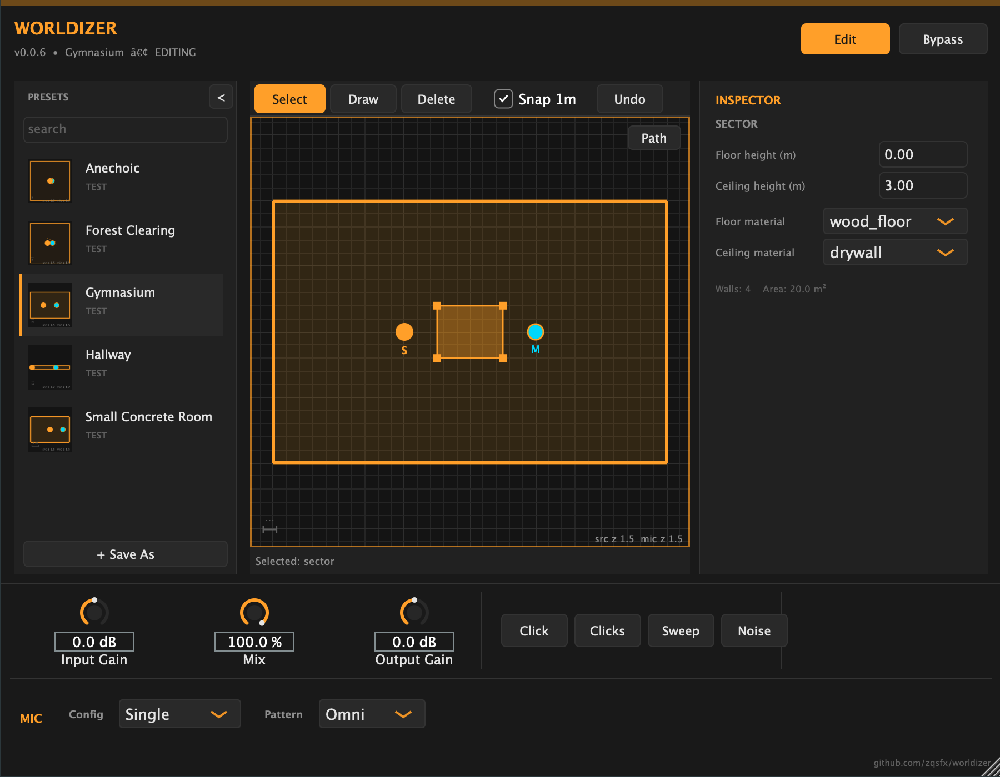

# Worldizer

**Think spatially, not parametrically. Re-record your sounds through a speaker into a space that only exists in the plugin.**

[](LICENSE)


---

## What is Worldizer?

Worldizer is a free, open-source VST3 plugin for SFX sound designers. It simulates **worldizing** — the technique pioneered by Walter Murch and Ben Burtt of re-recording a sound through a loudspeaker into a real physical space, then capturing it with microphones. Instead of dialing in abstract reverb parameters, you place a source and a microphone inside a space and let a geometric acoustics engine compute how the sound actually travels.

Worldizer is built for two complementary ways of working:

- **Murch mode (realism).** Place dialogue or effects believably in a space — a stairwell, an alley, a parking garage. Distance is the headline cue; room tone, signal-path character, and source/mic choices do the rest.
- **Burtt mode (transformation).** Treat the speaker and the space as creative instruments. Push extreme reproducers and impossible geometries to make sounds that never existed.

Both modes share one engine: a Monte Carlo ray tracer (with statistical late-tail synthesis) that bakes an impulse response from your scene, a 2D top-down editor for authoring spaces, and — on the roadmap — a curated library of recorded speakers, microphones, and room tones.

**Directional acoustics (v0.0.5):** mics can be omnidirectional or shotgun (rotate the
shotgun toward or away from the source for a real, physical tonal change), and you can
choose a single mic, a coincident **stereo XY** pair (adjustable splay angle), or a
**spaced pair** — the last two produce a genuine stereo impulse response with the
inter-channel level and time differences of the real recording techniques.

**Doom-style geometry editor (v0.0.6):** switch to **Edit** mode and draw your own
acoustic space sector-by-sector — click vertices in the top-down view, click the first
vertex to close, then set floor / ceiling heights and per-surface materials in the
right-side inspector. Hear the space update live as you drag vertices or change
materials, and **Save As** to add it to your user library.

## Screenshot



*Edit mode: the sidebar (left), a top-down room view with the tool palette
(Select / Draw / Delete + 1 m snap + Undo) and a sample sector under edit, and the
inspector (right) showing sector floor / ceiling heights and materials. The status
bar reports the current operation. The Edit button glows amber while editing.*

## Status

> **Pre-alpha — under active development. Not yet ready for production use.**

The project is being built in slices. The acoustics engine, convolution runtime, preset
library, browse-mode UI, directional/stereo mics, and the Doom-style geometry editor are
all in place; recorded source/mic character libraries, ambient beds, and the curated
preset collection are the next slices.

## Quick Start (build from source)

Worldizer uses CMake and JUCE 8.x (added as a git submodule).

```bash
# 1. Clone with submodules
git clone --recurse-submodules https://github.com/themightyzq/worldizer.git
cd worldizer

# If you already cloned without --recurse-submodules:
git submodule update --init --recursive

# 2. Configure and build (Release, Universal Binary on macOS)
cmake -B build -DCMAKE_BUILD_TYPE=Release
cmake --build build --config Release

# 3. First-time setup only: bake the shipped presets, then rebuild to embed them.
#    (A fresh checkout builds fine without this — it just has no preset library yet.)
./build/BakePresets_artefacts/Release/BakePresets
cmake --build build --config Release
```

The built artefacts land in `build/Worldizer_artefacts/Release/`. With `COPY_PLUGIN_AFTER_BUILD` enabled, the VST3 is also installed to your user VST3 folder.

**About the preset step:** the shipped presets (`.wzpreset` bundles) are generated
from the test-scene definitions by the `BakePresets` tool and embedded into the
plugin. They are not committed to the repo, so on a fresh checkout you run
`BakePresets` once and rebuild. After that, rebuilds pick the presets up
automatically. User presets live under your OS user-data directory —
`~/Library/Application Support/ZQSFX/Worldizer/Presets/` on macOS, `%APPDATA%\ZQSFX\Worldizer\Presets\`
on Windows, `~/.config/ZQSFX/Worldizer/Presets/` on Linux (drop a `.wzpreset` directory
there and restart the plugin).

Convenience scripts live in [`Scripts/`](Scripts/):

```bash
./Scripts/build_universal.sh            # clean Release build
./Scripts/verify_universal_binary.sh    # assert arm64 + x86_64
```

### Requirements

Worldizer targets **macOS, Windows, and Linux** as equal-priority platforms (CI builds
and tests all three):

- CMake 3.22+ and a C++17 toolchain
- **macOS:** 10.15+, Xcode Command Line Tools (builds a Universal Binary: arm64 + x86_64)
- **Windows:** Visual Studio 2022 (MSVC) build tools
- **Linux:** GCC/Clang + the JUCE dev packages (ALSA, X11, FreeType, Mesa/GL — see the
  `Install Linux dependencies` step in [`.github/workflows/build.yml`](.github/workflows/build.yml))

## Plugin Formats & Host Compatibility

- **Formats:** VST3, Standalone
- **Primary host:** Soundminer (the plugin is tuned for fast cold start and clean state save/restore)
- **Also targets:** Reaper, Pro Tools, Logic, and any VST3-capable DAW
- **Channels:** stereo in / stereo out (multichannel is post-MVP)

## License

Worldizer is licensed under the **GNU General Public License v3.0**. See [`LICENSE`](LICENSE). This matches JUCE's open-source license terms. There is no DRM, there are no paid features, and there is no telemetry.

## Contributing

Contributions are welcome — code, bug reports, feature ideas, and especially **recordings** (speaker IRs, mic IRs, room tones). Open an issue or pull request on GitHub to get involved.

## Acknowledgments

- **[JUCE](https://juce.com/)** — the C++ framework Worldizer is built on.
- **Walter Murch and Ben Burtt**, and the wider tradition of worldizing in film sound, whose practice this plugin is a love letter to.
